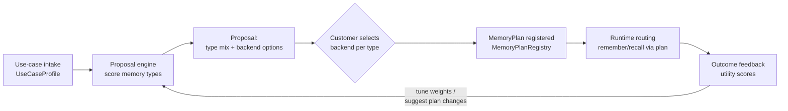
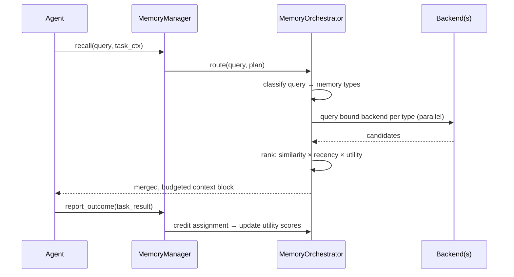

# Agent Memory Architecture

Design document for the `future_agents` memory subsystem: memory taxonomy,
framework landscape, proposed package layout, the **Memory Orchestrator**
(use-case-driven memory selection, registration, and routing), and the
patentability strategy.

---

## 1. Memory taxonomy

Based on the CoALA taxonomy (working / episodic / semantic / procedural),
extended with two types specific to a multi-agent organization.

| Type | What it stores | Retrieval trigger | Backing primitive (existing) |
|---|---|---|---|
| **Working** | Current task context, scratchpad | Always in-context | per-agent context window |
| **Episodic** | Past events/interactions with time + outcome ("what happened") | Similarity + recency | `EventBus` (auto-capture) |
| **Semantic** | Facts, entities, relations ("what is true") | Query/entity match | `KnowledgeStore` / `KnowledgeEntry` |
| **Procedural** | Learned skills, successful action sequences, prompts | Task-type match | `PatternLibrary`, `models/skill.py` |
| **Reflective** *(extension)* | Self-generated lessons distilled from episodes | Pre-task | `ReflectionRunner` output |
| **Social/agent** *(extension)* | What each agent knows about other agents' reliability, expertise | Delegation time | `AgentRegistry` + `models/feedback.py` |

---

## 2. Framework landscape (prior art)

| Framework | Approach | Relevance |
|---|---|---|
| **CoALA** | Taxonomy paper defining the 4 memory types; no implementation | Vocabulary + structure |
| **Letta (MemGPT)** | OS-style memory paging: core memory blocks + archival; agent self-edits memory via tools | Working-memory management model |
| **Mem0** | LLM extraction pipeline: conversation → add/update/delete ops on vector + graph store | Consolidation pipeline model |
| **Zep / Graphiti** | Temporal knowledge graph; facts carry `valid_at`/`invalid_at`, bi-temporal edges | Semantic backend option |
| **LangMem** | Hot-path vs background memory formation | Worker-based consolidation model |
| **A-MEM** | Zettelkasten-style agentic memory; notes link and evolve | Reflective memory linking |

All of these are published prior art — see §7 for what that means for patent strategy.

---

## 3. Package layout

```
future_agents/memory/
  models.py            # EpisodicRecord, ProceduralSkill, Reflection, MemoryQuery,
                       # UseCaseProfile, MemoryPlan, BackendBinding
  episodic_store.py    # subscribes to EventBus — every task/event auto-recorded
  semantic_store.py    # thin layer over existing KnowledgeStore
  procedural_store.py  # skill/pattern memory, links to PatternLibrary
  working_memory.py    # per-agent context window mgr w/ token budget
  consolidator.py      # background: episodes → semantic facts + reflections
  orchestrator.py      # MemoryOrchestrator — see §4
  registry.py          # MemoryPlanRegistry — registered plans per tenant/agent
  backends/
    base.py            # MemoryBackend protocol (store/query/delete/health)
    local.py           # in-process dict/EMA stores (default, zero-dep)
    vector.py          # vector DB adapter (Chroma/pgvector/Qdrant)
    graph.py           # graph adapter (Neo4j/Graphiti-style temporal graph)
    letta.py           # Letta/MemGPT adapter (optional extra)
    mem0.py            # Mem0 adapter (optional extra)
    zep.py             # Zep adapter (optional extra)
  memory_manager.py    # per-agent facade: remember(), recall(), reflect(), forget()
```

Integration points:

- `MemoryManager` injected into `BaseAgent`.
- New `MemoryConsolidationWorker` joins the existing five workers
  (mirrors `KnowledgeSynthesisWorker` structure).
- External backend SDKs are optional extras with `try/except ImportError`
  guards, same as `anthropic`.
- Decay/forgetting reuses the `usefulness_score` EMA already on
  `KnowledgeEntry`.

---

## 4. Memory Orchestrator

The orchestrator is the customer-facing brain of the subsystem. It decides
**which memory types a use case needs**, proposes **backend options** the
customer can choose from, **registers** the chosen plan, and then **routes
all memory traffic** according to that plan.

### 4.1 Lifecycle: propose → select → register → route



### 4.2 Use-case intake — `UseCaseProfile`

Captured from a short structured intake (API fields or interactive
questionnaire):

```python
class UseCaseProfile(BaseModel):
    tenant_id: str
    name: str                        # "customer support bot", "code reviewer"
    interaction_style: Literal["conversational", "task", "pipeline"]
    session_length: Literal["short", "long", "persistent"]
    needs_personalization: bool      # remember user prefs across sessions
    needs_factual_recall: bool       # entities, relations, domain facts
    needs_skill_learning: bool       # improve at repeated task types
    multi_agent: bool                # delegation between agents
    temporal_queries: bool           # "what was true last month"
    compliance: Literal["none", "standard", "strict"]  # affects forget/audit
    scale_hint: Literal["prototype", "team", "org"]
```

### 4.3 Proposal engine

Deterministic scoring matrix (auditable — no LLM required for the baseline),
optionally refined by an LLM pass for free-text use-case descriptions.

| Profile signal | Working | Episodic | Semantic | Procedural | Reflective | Social |
|---|---|---|---|---|---|---|
| `conversational` | ✅ high | ✅ high | ● med | – | ● med | – |
| `task` / `pipeline` | ✅ high | ● med | ● med | ✅ high | ✅ high | – |
| `needs_personalization` | – | ✅ high | ✅ high | – | – | – |
| `needs_factual_recall` | – | – | ✅ high | – | – | – |
| `needs_skill_learning` | – | ● med | – | ✅ high | ✅ high | – |
| `multi_agent` | – | – | – | – | – | ✅ high |
| `temporal_queries` | – | ✅ high | ✅ high (bi-temporal) | – | – | – |

Each memory type scoring above threshold is included in the proposal with
2–3 backend options, ranked by fit:

| Memory type | Option A (default, zero-dep) | Option B | Option C |
|---|---|---|---|
| Episodic | `local` (in-proc + JSONL) | `vector` (Chroma/pgvector) | `letta` archival |
| Semantic | `local` (KnowledgeStore) | `graph` (temporal KG) | `zep` / `mem0` |
| Procedural | `local` (PatternLibrary) | `vector` | — |
| Reflective | `local` | `vector` | — |
| Social | `local` (AgentRegistry ext) | `graph` | — |
| Working | always `local` (context mgr) | — | — |

Proposal output is a `MemoryProposal`: per-type recommendation + options +
one-line rationale each, so the customer sees *why* each type was proposed.

### 4.4 Selection & registration

- Customer picks one backend per proposed type (or accepts defaults).
- Result is frozen into a `MemoryPlan`:

```python
class BackendBinding(BaseModel):
    memory_type: MemoryType
    backend: str                 # "local" | "vector" | "graph" | "letta" | "mem0" | "zep"
    config_ref: str              # key into config, secrets via env vars only
    enabled: bool = True

class MemoryPlan(BaseModel):
    id: str
    tenant_id: str
    use_case: UseCaseProfile
    bindings: list[BackendBinding]
    version: int                 # plans are versioned like KnowledgeEntry
    created_at: datetime
```

- `MemoryPlanRegistry.register(plan)` validates backend availability
  (import guard + health check), persists the plan, and emits a
  `memory.plan.registered` event on the `EventBus`.
- Plans are versioned; changing a binding creates a new version — old data
  can be migrated lazily or bulk-exported between backends via the common
  `MemoryBackend` protocol.

### 4.5 Runtime routing

Every `remember()` / `recall()` goes through the orchestrator:



- **Write path**: orchestrator classifies each memory item (episode? fact?
  skill?) and fans out to the bound backend(s) for that type.
- **Read path**: query classified into relevant types, bound backends
  queried in parallel, results merged and ranked by
  `similarity × recency × proven utility`, then trimmed to the agent's
  working-memory token budget.
- **Feedback path**: task outcomes flow back (via `models/feedback.py`) and
  update the utility score of every memory recalled during that task
  (see §5). Persistently low-utility bindings trigger a *plan-change
  suggestion* — the orchestrator can propose switching a type to a
  different backend, closing the loop back to §4.1.

### 4.6 Customer-facing flow summary

1. Customer describes use case (structured intake).
2. System proposes memory-type mix + backend options with rationale.
3. Customer selects from options (defaults are zero-dependency local).
4. Plan registered, versioned, health-checked.
5. All agent memory traffic flows through the plan automatically.
6. Outcome feedback tunes ranking and can suggest plan upgrades.

---

## 5. Core differentiator: outcome-weighted consolidation

The recommended unique mechanism (candidate #1 from the evaluation below):

- Every memory carries a live **utility score** (EMA, like
  `KnowledgeEntry.usefulness_score`).
- When a task completes, the outcome signal is **credit-assigned to the
  specific memories recalled during that task** — positive outcomes raise
  their utility, failures attributed to misleading recalls lower it.
- Recall ranking = `similarity × recency × proven utility`.
- Consolidation promotes episodic → semantic → procedural **only when
  utility crosses a threshold**; demotion/forgetting on failure attribution.
- Existing systems decay by time or access count; closing the loop on
  **task-outcome credit assignment to individual memories** is the
  differentiator.

Alternative angles considered:

1. **Outcome-weighted consolidation** — *chosen, phase 1.*
2. **Cross-agent memory economy** — memories with provenance + per-agent
   trust; recall blends private and org memory with role-scoped access
   gated by guardrails profiles. *Phase 2.*
3. **Bi-temporal versioned memory with rollback** — replay an agent's
   belief state "as of time T". Overlaps Zep; weaker novelty. *Optional.*

---

## 6. Phasing

| Phase | Scope |
|---|---|
| 1 | `memory/` package, local backends, `MemoryManager` on `BaseAgent`, consolidator worker, outcome-weighted utility loop |
| 2 | Orchestrator: intake → proposal → registration → routing; vector + graph adapters |
| 3 | External adapters (Letta, Mem0, Zep) as optional extras; plan-change suggestions |
| 4 | Cross-agent memory economy (trust-weighted sharing across the 10k-role registry) |

---

## 7. Patentability strategy

- The space is crowded (MemGPT, Mem0, Zep have papers/filings; CoALA is
  published prior art). A generic "multi-type memory system" is **not**
  patentable.
- Novelty must live in a **specific mechanism**. Two candidates here:
  - §5's credit-assignment algorithm — *how* outcome feedback propagates to
    the specific memories recalled during a task and gates
    promotion/demotion across memory types.
  - §4's orchestrator loop — automated use-case → memory-plan proposal with
    outcome-driven plan-change suggestions (selection *and* re-selection of
    memory backends driven by measured memory utility).
- Practical path: build it, keep dated design records, run a prior-art
  search, then file a **provisional** (cheap, buys 12 months) with a patent
  attorney. This document is a technical disclosure, not legal claims.
